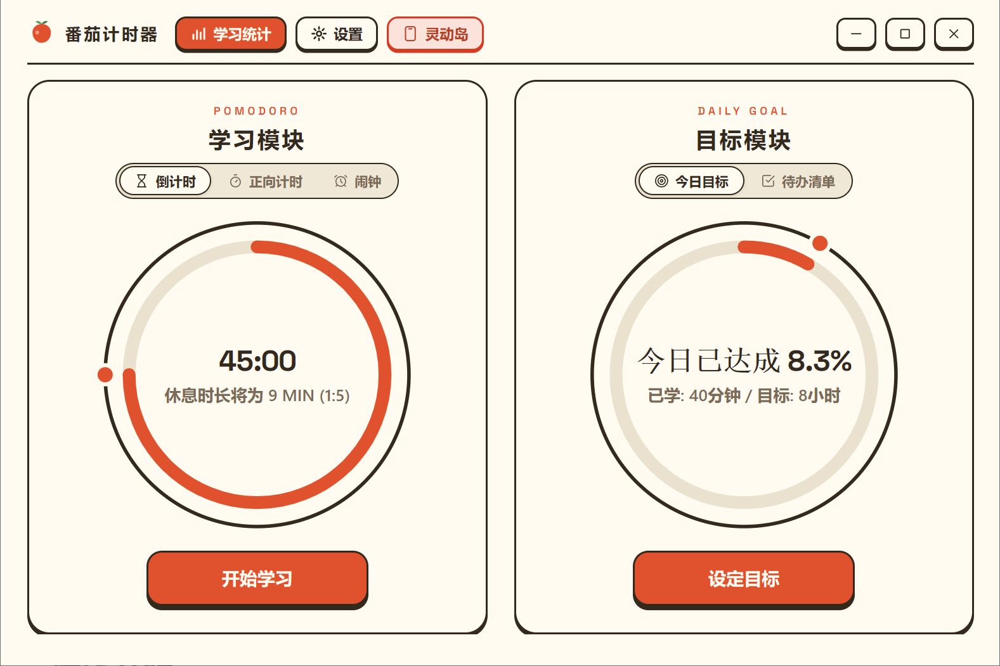
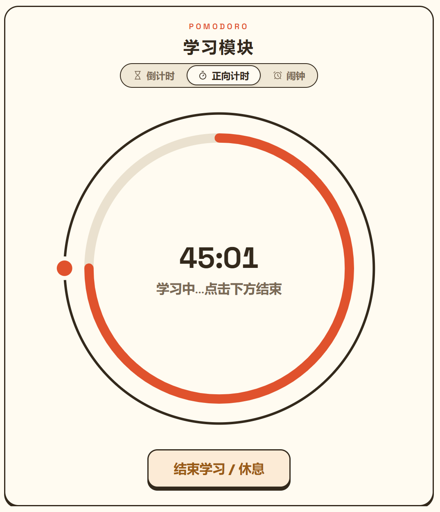
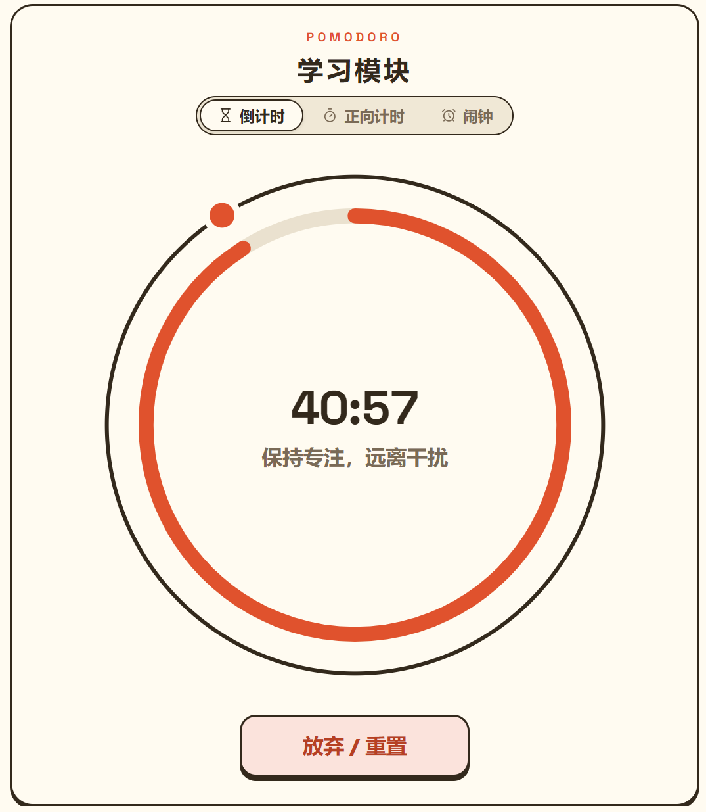
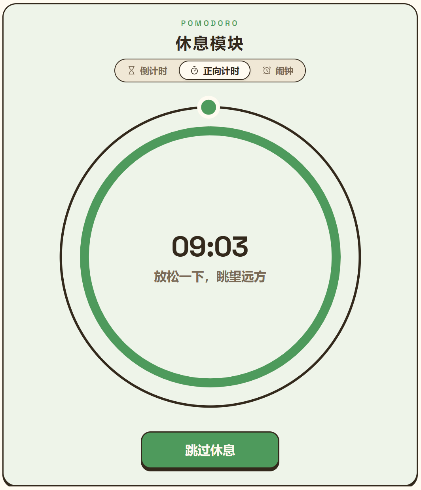
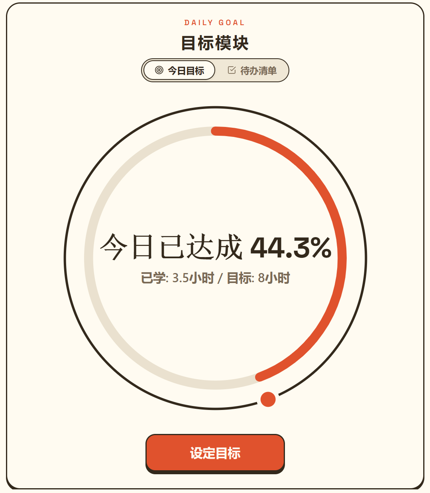
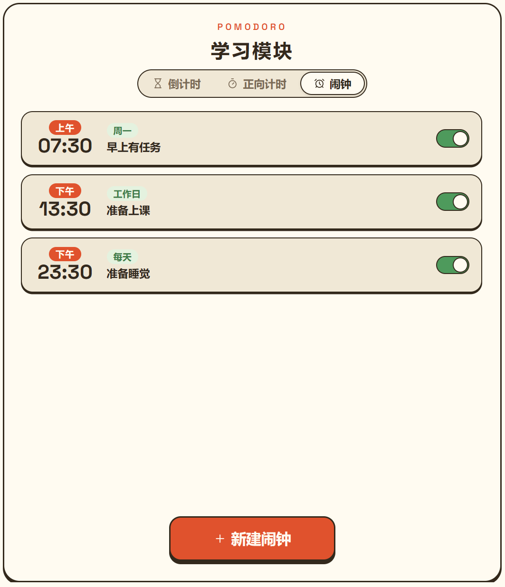
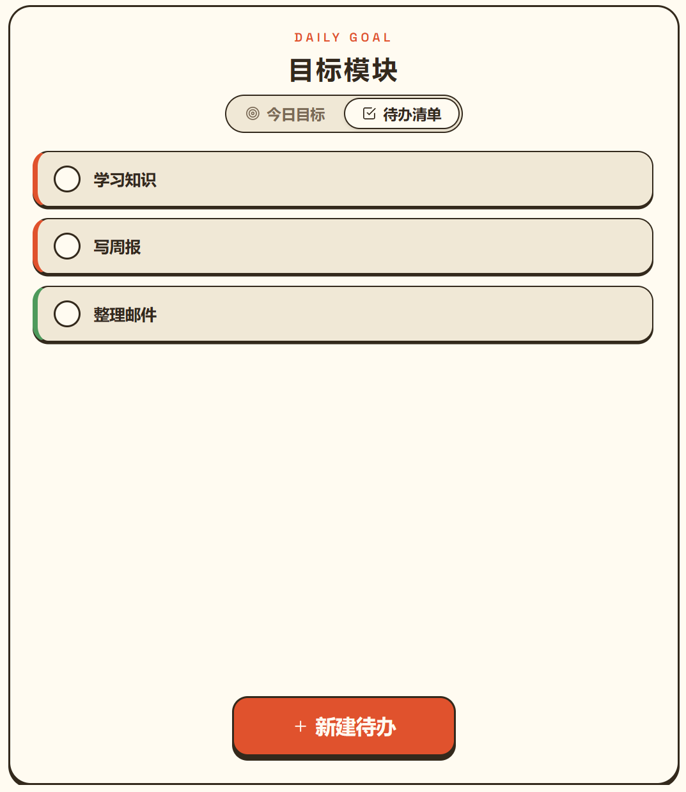
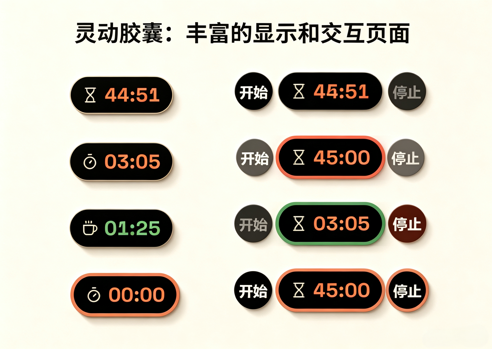
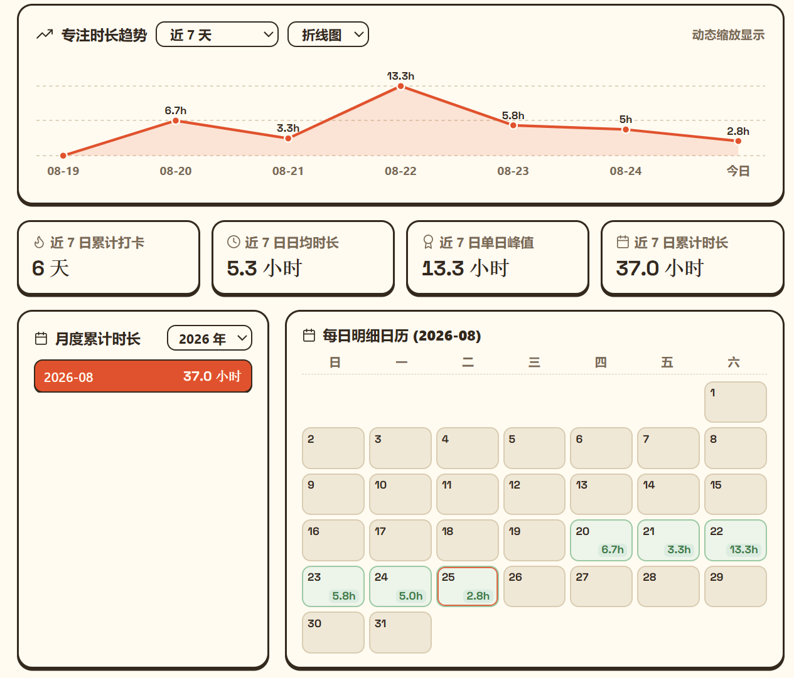

# 番茄计时器 - Tomato Timer

番茄钟桌面小工具：Windows 桌面程序。无框架、无构建步骤、无依赖管理。

根据自己的需求构建的小工具，需要自取。

**主界面展示**

<p align="center">
  
</p>

## 功能特性

- **学习计时**：倒计时 / 正向计时两种学习模式。

<p align="center">
  
</p>

<p align="center">
  
</p>

- **自动休息 + 每日目标**：学习结束自动休息（依照比例计算），设定目标并自动记录每日时长。

<p align="center">
  
</p>

<p align="center">
  
</p>

- **闹钟 + 待办清单**：提供闹钟与待办清单功能，避免忘记重要事项。

<p align="center">
  
</p>

<p align="center">
  
</p>

- **灵动胶囊**：计时中最小化后，顶部悬浮胶囊显示剩余时间，拖动图标移动、点击恢复、悬停执行快捷键。

<p align="center">
  
</p>

- **多维数据统计**：按 7 / 14 / 30 天或 1 年粒度的柱 / 折线图，4 个指标卡，月度累计列表，每日明细日历。

<p align="center">
  
</p>

- **数据管理**：学习记录持久化于本地，支持 JSON 导出 / 导入（json 格式如下）：

```json
{
  "2026-08-21": 12000,
  "2026-08-20": 24000,
  "2026-08-22": 48000,
  "2026-08-23": 21000,
  "2026-08-25": 10040,
  "2026-08-24": 18000
}
```

## 快速开始

从 [Releases](https://github.com/muyangren-k/TomatoTimer/releases) 下载 `TomatoTimer-v1.0.0-Windows.exe`，双击运行（便携单文件，无需安装）。

- 依赖：WebView2 Runtime（Windows 10 1809+ 一般已内置）
- 数据保存在本地应用数据目录，更换位置不丢失

## 从源码构建

前置要求：Rust、Node.js、WebView2 Runtime。

```bash
# 开发调试
npx tauri dev

# 构建便携 exe（输出到 src-tauri/target/release/）
npx tauri build --no-bundle
```

## 技术栈

- 前端：原生 HTML / CSS / JavaScript 单文件（`dist/index.html`）
- 桌面：Tauri 2（Rust 后端 + WebView2），双窗口（主界面 + 灵动岛）

## 目录结构

```
├── dist/             # Tauri 前端（index.html + 本地字体 + 内置铃声）
├── src-tauri/        # Tauri 工程（Rust 后端）
│   ├── tauri.conf.json
│   ├── capabilities/
│   └── src/
└── screenshots/      # README 截图
```

## 许可证

[MIT](LICENSE)
